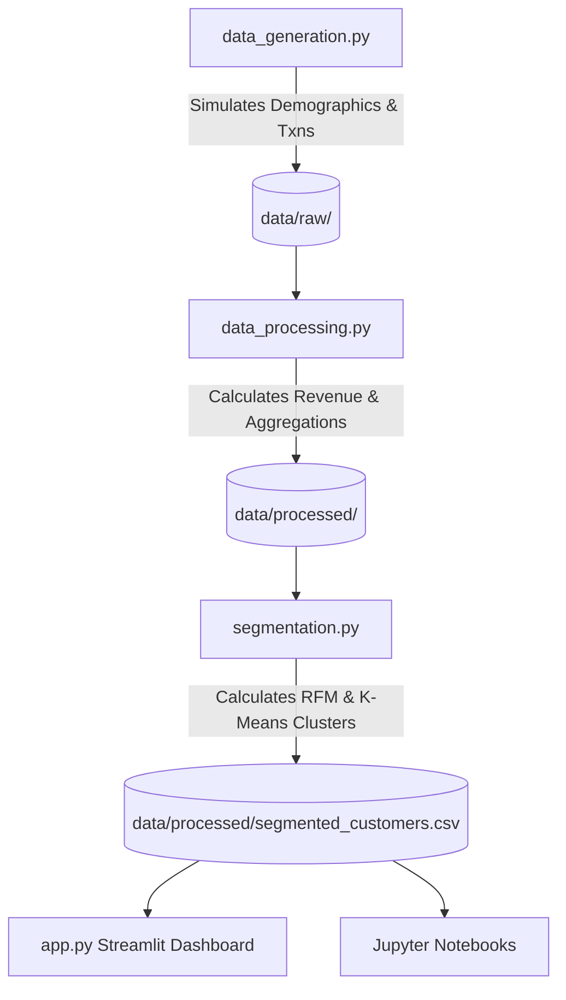

# Customer Behavior & Purchase Analytics Portal

[](https://www.python.org/)
[](https://streamlit.io/)
[](https://scikit-learn.org/)
[](https://opensource.org/licenses/MIT)

🔗 **Live Portal Link**: [https://customer-purchase-behavior-analytics-1.onrender.com](https://customer-purchase-behavior-analytics-1.onrender.com)

An end-to-end data analytics and machine learning solution focused on understanding customer purchasing patterns, demographics, and engagement trends. The repository contains a complete pipeline from synthetic data simulation and preprocessing to unsupervised machine learning segmentation and a premium interactive Streamlit dashboard.

---

## 📸 Dashboard Preview

Our interactive dashboard features four major monitoring areas:
1. **Overview & Demographics**: Interactive distributions of customer age, annual incomes, payment splits, and locations.
2. **Product Performance**: Breakdown of category sales volumes, revenues, and top-selling products.
3. **Customer Segmentation**: A 3D behavioral projection mapping Recency vs. Frequency vs. Spend (RFM) and K-Means clusters.
4. **Retention & Churn Analysis**: Critical warning indicators linking user satisfaction to churn rates and lifetime value.

---

## 🛠️ Project Architecture



---

## 🚀 Getting Started

### 1. Prerequisites
Ensure you have Python 3.8+ installed. You can install all project dependencies using:
```bash
pip install -r requirements.txt
```

### 2. Running the Data Pipeline
Execute the scripts in order to generate, clean, and segment the customer data:

```bash
# Step 1: Generate raw synthetic transaction & customer data
python3 src/data_generation.py

# Step 2: Clean and engineer customer metrics
python3 src/data_processing.py

# Step 3: Run RFM scoring & K-Means clustering
python3 src/segmentation.py
```

### 3. Launching the Interactive Dashboard
Run the Streamlit web application to explore the dashboards:
```bash
streamlit run app.py
```

---

## 📊 Analytics & Machine Learning Methodology

### Customer Segmentation (RFM heuristic)
Customers are bucketed into marketing tiers by compiling their quintile rank (1-5) across three metrics:
- **Recency (R)**: Days since last transaction.
- **Frequency (F)**: Total number of orders placed.
- **Monetary (M)**: Net lifetime expenditure.

Mapped categories include **Champions**, **Loyalists**, **Potential Loyalists**, **At Risk**, **Can't Lose Them**, and **Hibernating**.

### Unsupervised Clustering (K-Means)
To discover organic behavioral patterns, we apply the K-Means clustering algorithm:
1. **Feature Engineering**: Selects `recency_days`, `total_transactions`, and `total_spend`.
2. **Log Transform**: Normalizes right-skewed purchasing features.
3. **Standardization**: Applies `StandardScaler` to uniform feature variance.
4. **Execution**: Clusters customers into four distinct strategic groups:
   - **VIP Spenders**: Highly engaged, highest value, and highly active.
   - **Active Customers**: Consistent order frequencies and stable revenues.
   - **Slipping Customers**: Relapsed buyers with high recency but historical volume.
   - **Lost Customers**: One-off purchasers with minimal spend and high churn risk.

---

## 🎯 Business Recommendations & Marketing Strategies

- **VIP Spenders**: Enroll in a premium tier reward system, offer exclusive early access, and ask for referrals.
- **Active Customers**: Leverage cross-selling and product bundles tailored to their `preferred_category` to increase Average Order Value (AOV).
- **Slipping Customers**: Launch automated win-back drip marketing campaign offers containing customized discounts.
- **Lost Customers**: Dispatch low-cost surveys to assess service gaps and filter out inactive emails.

---

## 📂 Repository Structure

- `data/`
  - `raw/`: Raw CSV files (`customers.csv`, `transactions.csv`).
  - `processed/`: Output profiles and segmented data (`cleaned_transactions.csv`, `customer_profiles.csv`, `segmented_customers.csv`).
- `src/`
  - `data_generation.py`: Script to simulate synthetic retail transaction histories.
  - `data_processing.py`: Data cleaning, formatting, and aggregations.
  - `segmentation.py`: RFM formulation and Scikit-Learn K-Means modeling.
- `notebooks/`
  - `01_eda_and_cleaning.ipynb`: Walkthrough of exploratory visual analysis.
  - `02_customer_segmentation.ipynb`: Machine learning clustering workflow.
- `app.py`: Main Streamlit app codebase.
- `requirements.txt`: Project package dependencies list.
- `.gitignore`: System and execution files ignore configs.

---

## 👨‍💻 Author & Contact

- **Developer**: Ansh Shukla
- **Email**: [ianshshuklaoffc@gmail.com](mailto:ianshshuklaoffc@gmail.com)
- **LinkedIn**: [linkedin.com/in/ansh-shukla-656a211b4](https://www.linkedin.com/in/ansh-shukla-656a211b4/)
- **Live Demo Link**: [customer-purchase-behavior-analytics-1.onrender.com](https://customer-purchase-behavior-analytics-1.onrender.com)
